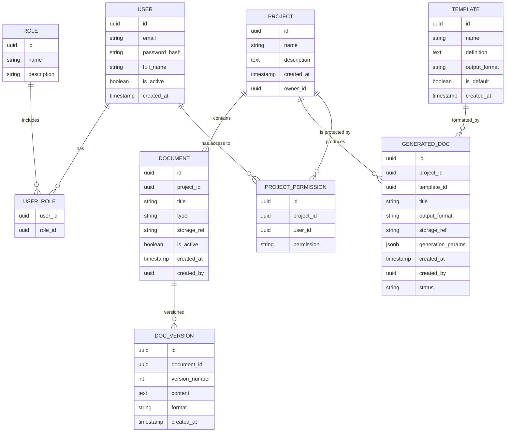
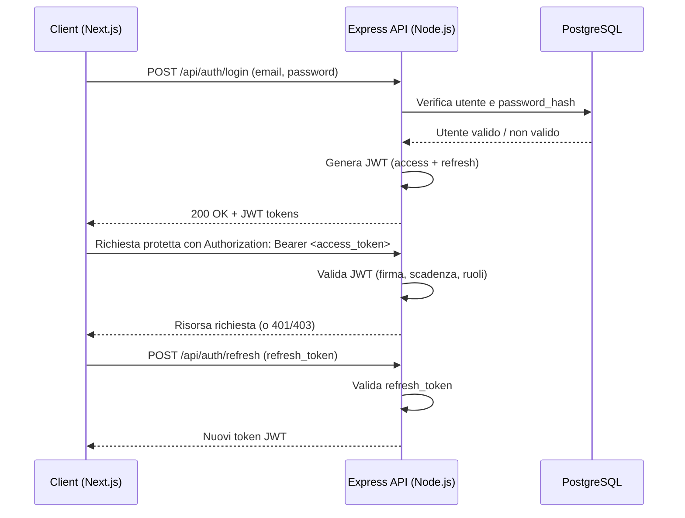
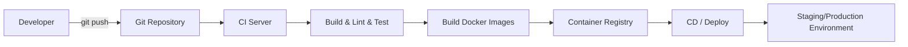

# Architettura - test

**Versione:** 1.0  
**Data:** 16/01/2026  
**Autore:** Architect Agent  
**Stato:** Draft  

---

## 1. Panoramica del Sistema

L’applicazione “test” è una piattaforma web full‑stack basata su:

- **Frontend:** Next.js (React) in TypeScript
- **Backend:** Node.js con **Express** in TypeScript (API REST)
- **Database principale:** **PostgreSQL**
- **Cache & messaging leggero:** **Redis**
- **Containerizzazione:** **Docker**

Obiettivo architetturale principale:  
“**Genera documentazione basandoti sui documenti del progetto**”.  
Il sistema quindi:

1. Riceve e gestisce documenti di progetto (testo, file, metadati).
2. Indicia e struttura i contenuti (a livello applicativo, senza specificare qui engine di ricerca full‑text).
3. Espone API per generare documentazione (report, specifiche, sommari, ecc.) a partire dai documenti esistenti.
4. Fornisce una UI web per:
   - gestione documenti
   - configurazione template di documentazione
   - avvio e monitoraggio generazioni di documenti.

L’architettura è **layered** con chiara separazione di responsabilità, supporto a **scalabilità orizzontale**, **sicurezza basata su JWT**, caching con **Redis**, e deployment containerizzato con **Docker**.

---

## 2. Diagramma dei Componenti

```mermaid
flowchart TB
    subgraph Browser
        UI[Next.js Web UI (TypeScript)]
    end

    subgraph Edge
        CDN[CDN / Reverse Proxy]
    end

    subgraph Backend["Backend Node.js (Express + TypeScript)"]
        APIRest[REST API Layer]
        SVC[Application & Domain Services]
        AUTH[Auth & Security]
        CACHE[Redis Client]
        REPO[Repository Layer]
    end

    subgraph Data["Data Layer"]
        PG[(PostgreSQL)]
        REDIS[(Redis)]
        FS[(Object Storage / File System)]
    end

    UI -->|HTTPS| CDN -->|HTTPS| APIRest
    APIRest --> AUTH
    APIRest --> SVC
    SVC --> CACHE
    SVC --> REPO
    REPO --> PG
    REPO --> FS
    CACHE <--> REDIS
```

---

## 3. Layer Architecture

### 3.1. Presentation Layer

- **Tecnologia:**  
  - **Next.js** (React) + TypeScript  
  - Styling con CSS Modules / Tailwind / Styled Components (a scelta, vedi ADR)
- **Responsabilità:**
  - Rendering lato server (SSR) e/o statico (SSG) delle pagine
  - Gestione routing lato client (Next Router)
  - Gestione sessione lato client (storage del JWT, refresh)
  - Invocazione API REST del backend
  - Validazione form lato client (UI/UX, non di sicurezza)
  - Componenti per:
    - upload / gestione documenti
    - configurazione template
    - visualizzazione e download documentazione generata
    - gestione utenti/ruoli (se visibile lato UI)

### 3.2. Application Layer (Backend API)

- **Tecnologia:**  
  - **Node.js**  
  - **Express** (REST)  
  - TypeScript
- **Responsabilità:**
  - Esporre **REST API** JSON verso il frontend
  - Routing HTTP, mapping URL → controller
  - Validazione input (middleware + libreria es. Zod/Joi/Yup – vedi ADR)
  - Formattazione risposte e gestione errori (error handler centrale)
  - Gestione autenticazione e autorizzazione via middleware (JWT)
  - Coordinamento tra Presentation API e Business Services
  - Politiche di rate limiting e logging delle richieste

### 3.3. Business / Domain Layer

- **Tecnologia:**  
  - Servizi e use case in **TypeScript** (classi / funzioni)  
- **Responsabilità:**
  - Implementazione della **business logic**:
    - gestione ciclo di vita dei documenti di progetto
    - indicizzazione/organizzazione dei contenuti
    - generazione della documentazione (aggregazione, formattazione)
    - gestione versioni di documentazione generata
  - Orchestrazione di eventuali job asincroni (es. generazione di grandi report)
  - Gestione transazioni applicative (coordinate con il layer di persistenza)
  - Interazione con cache Redis tramite un service per:
    - cache di metadati documenti
    - cache di risultati di generazione se ripetuti
  - Applicazione delle regole di autorizzazione a livello di dominio (es. un PM può vedere solo documenti delle sue commesse)

### 3.4. Data Access Layer

- **Tecnologia:**  
  - PostgreSQL: tramite ORM/Query Builder (es. Prisma, TypeORM, Knex – da definire in ADR)  
  - Redis: client ufficiale `redis` o compatibile  
- **Responsabilità:**
  - Mappare entità dominio ↔ schema PostgreSQL
  - Eseguire query ottimizzate, con uso di transazioni
  - Incapsulare l’accesso alla cache Redis (get/set/invalidate)
  - Gestire la persistenza di:
    - metadati dei documenti
    - contenuti testuali indicizzati
    - template e configurazioni
    - utenti, ruoli, permessi
    - log delle generazioni di documenti
  - Gestire link ai contenuti binari (es. storage file, S3, filesystem) senza esporre dettagli all’Application Layer

---

## 4. Modello Dati

> Nota: il modello è logico/concettuale, da affinare in base ai documenti reali del progetto.



### 4.1. Entità Principali

| Entità          | Descrizione                                                                                     |
|-----------------|-------------------------------------------------------------------------------------------------|
| `USER`          | Utenti dell’applicazione (amministratori, PM, utenti standard).                                |
| `ROLE`          | Ruoli logici (ADMIN, PM, USER) per autorizzazione.                                             |
| `PROJECT`       | Progetto logico, contenitore di documenti e documentazione generata.                           |
| `DOCUMENT`      | Documento di progetto (analisi, requisiti, specifiche, ecc.), con riferimento a storage fisico.|
| `DOC_VERSION`   | Versioni storicizzate di un documento, con contenuto testuale indicizzabile.                   |
| `TEMPLATE`      | Template di generazione documentazione (es. specifica tecnica, manuale utente).                |
| `GENERATED_DOC` | Documento generato a partire da documenti e template; include parametri e riferimento allo storage. |
| `PROJECT_PERMISSION` | Permessi specifici utente‑progetto (es. VIEW, EDIT, GENERATE_DOC).                     |

---

## 5. API Strategy

### 5.1. REST Endpoints (esempi)

| Endpoint                         | Method | Descrizione                                                | Auth        |
|----------------------------------|--------|------------------------------------------------------------|------------|
| `POST /api/auth/login`          | POST   | Autenticazione utente, ritorna JWT                         | No         |
| `POST /api/auth/refresh`        | POST   | Refresh del token JWT                                      | JWT        |
| `GET /api/users/me`             | GET    | Dati utente corrente                                       | JWT        |
| `GET /api/projects`             | GET    | Lista progetti accessibili all’utente                      | JWT        |
| `POST /api/projects`            | POST   | Crea nuovo progetto                                        | JWT (PM+)  |
| `GET /api/projects/:id`         | GET    | Dettaglio progetto                                         | JWT        |
| `GET /api/projects/:id/docs`    | GET    | Lista documenti di progetto                                | JWT        |
| `POST /api/projects/:id/docs`   | POST   | Crea nuovo documento (metadata + upload link)             | JWT        |
| `GET /api/docs/:id/versions`    | GET    | Lista versioni di un documento                             | JWT        |
| `POST /api/docs/:id/versions`   | POST   | Aggiunge nuova versione del documento                      | JWT        |
| `GET /api/templates`            | GET    | Lista template disponibili                                 | JWT        |
| `POST /api/templates`           | POST   | Crea/aggiorna template                                     | JWT (ADMIN/PM) |
| `POST /api/projects/:id/generate`| POST  | Avvia generazione documento per un progetto                | JWT        |
| `GET /api/generated-docs/:id`   | GET    | Dettaglio documento generato + link download               | JWT        |
| `GET /api/generated-docs`       | GET    | Lista documenti generati (filtrabile per progetto)         | JWT        |

### 5.2. Authentication Flow



---

## 6. Security Architecture

### 6.1. Autenticazione

- **Meccanismo:**  
  - JWT access token + refresh token
- **Implementazione:**
  - Middleware Express per:
    - estrazione token da header `Authorization`
    - validazione firma (chiave segreta o chiave pubblica, vedi ADR)
    - verifica scadenza e revoca (lista nera refresh token se necessario)
  - Scadenza access token breve (es. 15–30 min)  
  - Scadenza refresh token più lunga (es. 7–30 giorni)
- **Password:**
  - Hash con **bcrypt** (work factor configurabile)
  - Politiche minime di complessità password configurabili

### 6.2. Autorizzazione

- **Modello:**  
  - **Role-based access control (RBAC)** con ruoli:
    - `ADMIN`: gestione globale utenti, template, impostazioni
    - `PM`: gestione progetti, documenti e generazione documentazione
    - `USER`: accesso limitato a progetti assegnati e generazione documenti dove permesso
- **Implementazione:**
  - Middleware di autorizzazione Express, con:
    - controllo ruolo minimo (`requireRole('PM')`, etc.)
    - controllo permessi specifici di progetto (`requireProjectPermission('VIEW')`)
  - Verifica combinata: ruolo globale + permesso contestuale

### 6.3. Protezione Dati

- **Trasporto:**
  - Solo **HTTPS** (terminazione TLS su reverse proxy / CDN)
- **Input Security:**
  - Validazione server‑side di tutti gli input (schema validation)
  - Sanitizzazione dei campi di testo per prevenire XSS e injection
- **Database:**
  - Principio di **least privilege** per l’utente PostgreSQL
  - Parametrizzazione di tutte le query (supportata dall’ORM)
- **CSRF:**
  - Per il frontend Next.js + API JWT:
    - utilizzo di header custom
    - eventuale double‑submit cookie se si usano cookie httpOnly
- **Logging di sicurezza:**
  - Audit di login, tentativi falliti, modifiche privilegi, accessi a generazioni di documenti sensibili

---

## 7. Architecture Decision Records (ADRs)

### ADR-001: Adozione Stack Node.js + Express + Next.js

- **Status:** Accepted  
- **Context:**  
  Il sistema richiede un frontend reattivo e SEO‑friendly, un backend leggero per API REST e rapida iterazione. Si vuole usare TypeScript per ridurre errori a runtime.
- **Decision:**  
  - Frontend con **Next.js** (React + TypeScript) per SSR/SSG.
  - Backend con **Node.js + Express** in TypeScript per API REST.
- **Consequences:**
  - **Positive:**
    - Stack unificato JavaScript/TypeScript frontend/backend.
    - Buon supporto per SSR, routing e build ottimizzata.
    - Facilità di integrazione con tool DevOps comuni.
  - **Negative:**
    - Richiede attenzione particolare alla gestione di concorrenza I/O e memory leak su Node.js.
    - Necessità di definire chiaramente boundaries tra Next.js API routes ed Express API (si consiglia API backend separata).

---

### ADR-002: Utilizzo di PostgreSQL come Database Principale

- **Status:** Accepted  
- **Context:**  
  I dati sono strutturati, relazionali (utenti, ruoli, progetti, documenti, template, log). Sono richieste funzionalità avanzate (transazioni, referential integrity).
- **Decision:**  
  - Utilizzare **PostgreSQL** come database relazionale primario.
- **Consequences:**
  - **Positive:**
    - Supporto robusto a transazioni, constraint, JSONB, full‑text search (eventualmente).
    - Ottima integrazione con ORM TypeScript.
  - **Negative:**
    - Necessità di gestione di scaling verticale/orizzontale (replica, sharding) più complessa di un NoSQL puro.

---

### ADR-003: Introduzione di Redis per Caching

- **Status:** Accepted  
- **Context:**  
  Alcune operazioni sono ripetitive (lettura metadati documenti, template, risultati di generazioni frequentemente richieste). È necessario ridurre il carico su PostgreSQL e migliorare la latenza.
- **Decision:**  
  - Utilizzare **Redis** come sistema di cache e per piccoli key‑value volatili.
- **Consequences:**
  - **Positive:**
    - Migliore performance e tempi di risposta.
    - Possibilità futura di usare Redis anche per locking distribuito e job queue leggera.
  - **Negative:**
    - Maggiore complessità operativa (nuovo componente da gestire).
    - Rischio di inconsistenza se la politica di invalidazione non è ben progettata.

---

### ADR-004: Adozione di JWT per Autenticazione

- **Status:** Accepted  
- **Context:**  
  Il sistema deve essere facilmente scalabile con più istanze backend; la gestione di sessione server‑side è meno desiderabile.
- **Decision:**  
  - Utilizzare **JWT** come meccanismo di autenticazione (access + refresh token).
- **Consequences:**
  - **Positive:**
    - Scalabilità orizzontale facilitata: nessun stato di sessione centralizzato richiesto.
    - Facilità di integrazione con client esterni futuri (es. CLI, altre app).
  - **Negative:**
    - Gestione revoca token più complessa (necessità di blacklist/short expiry).
    - Rischio sicurezza più elevato se i token non sono gestiti/salvati correttamente lato client.

---

### ADR-005: Deployment Containerizzato con Docker

- **Status:** Accepted  
- **Context:**  
  Si richiede facilità di deployment in ambienti diversi (sviluppo, staging, produzione) e futura integrazione con orchestratori (Kubernetes, ECS, ecc.).
- **Decision:**  
  - Distribuire frontend, backend e componenti di supporto (PostgreSQL, Redis) come **container Docker** separati.
- **Consequences:**
  - **Positive:**
    - Portabilità e consistenza degli ambienti.
    - Facilità di scalare singoli servizi.
  - **Negative:**
    - Richiede pipeline CI/CD e competenze DevOps di base.
    - Necessita di monitoraggio risorse per evitare over‑commit.

---

## 8. Scalabilità & Performance

### 8.1. Caching Strategy (con Redis)

- **Livello API:**
  - Caching di:
    - metadati di progetto e documenti (letture frequenti)
    - template di generazione (relativamente statici)
  - Chiavi cache con pattern:  
    - `project:<id>`  
    - `document:<id>`  
    - `template:<id>`
- **Invalidazione:**
  - Event‑based:
    - alla modifica/creazione/cancellazione del progetto/documento/template, invalidare le relative chiavi Redis.
- **TTL:**
  - TTL ragionevole (es. 5–15 minuti) per evitare staleness prolungata.

### 8.2. Ottimizzazione Database

- **Schema:**
  - Indici su:
    - `project_id` nelle tabelle `DOCUMENT`, `GENERATED_DOC`, `PROJECT_PERMISSION`
    - `email` in `USER` (unique)
    - campi di ricerca frequente (nome progetto, titolo documento)
- **Query:**
  - Uso di **paginazione** per liste (documenti, progetti, generati).
  - Evitare N+1 queries tramite join ben progettate o ORM con `include`/`relations`.
- **Caricamento:**
  - Lazy loading delle relazioni non essenziali (es. versioni documento) e endpoint dedicati per informazioni dettagliate.

### 8.3. Scalabilità Orizzontale

- **Backend Node.js:**
  - Possibilità di eseguire più istanze dietro un **reverse proxy / load balancer**.
  - Nessuno stato in memoria condivisa tra istanze (grazie a JWT + Redis).
- **Database:**
  - Replica read‑only per carichi di lettura elevati (futuro).
- **Frontend:**
  - Next.js build statiche distribuite tramite CDN, ove possibile (pagine SSG).

---

## 9. Deployment Strategy

### 9.1. Environment

- **Container Docker distinti:**
  - `frontend`: Next.js (build + runtime)
  - `backend`: Node.js + Express API
  - `db`: PostgreSQL
  - `cache`: Redis
- **Ambienti:**
  - `dev`: docker‑compose locale con hot reload
  - `staging`: ambiente pre‑produzione con dati di test
  - `prod`: cluster (es. Cloud Run, Kubernetes, ECS) con scaling automatico

### 9.2. CI/CD Pipeline



- **Passi principali:**
  - Lint + test unitari (frontend e backend).
  - Build Next.js (output ottimizzato).
  - Build immagini Docker per backend e frontend.
  - Deploy automatico su staging; approvazione manuale per produzione.

---

## 10. Monitoring & Observability

- **Logging:**
  - Backend: logger strutturato (es. pino/winston) con output JSON.
  - Correlation id per tracciare richieste tra componenti.
- **Metrics:**
  - Esposizione endpoint `/health` e `/metrics` (es. Prometheus format) dal backend.
  - Metriche chiave:
    - latency API
    - error rate
    - throughput
    - utilizzo DB (connessioni, slow queries)
- **Alerting:**
  - Integrazione con sistema di monitoring (es. Grafana + Prometheus, o Cloud Monitoring).
  - Alert su:
    - error rate elevato
    - latency superiore a soglie configurate
    - risorse (CPU, RAM) oltre soglia
    - spazio disco DB.

---

Se vuoi, posso estendere la sezione modello dati con esempi di tabelle PostgreSQL (DDL) o dettagliare gli endpoint REST per la parte di generazione documentazione.