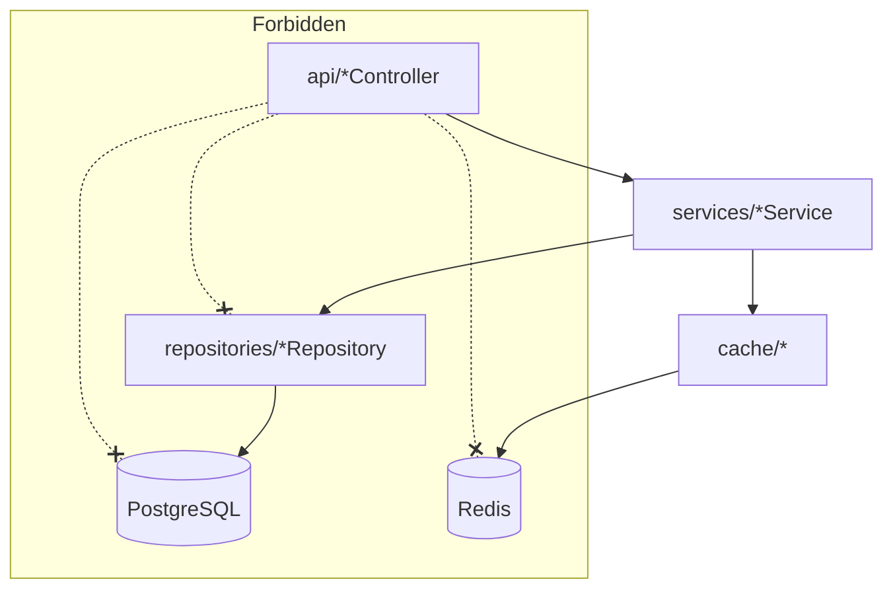

# Source Tree - test

**Versione:** 1.0  
**Data:** 16/01/2026  
**Autore:** Architect Agent  

---

## 1. Introduzione

Questo documento descrive l’organizzazione del codice sorgente del progetto **test**, coerente con l’architettura definita (Next.js frontend, backend Node.js/Express, PostgreSQL, Redis, Docker).  
Il progetto segue un’impostazione **layered** e un’organizzazione **package‑by‑feature** soprattutto lato backend e moduli core.

---

## 2. Panoramica della Struttura

Struttura principale del repository:

```text
project-root/
├── backend/          # Backend Node.js/Express (API REST)
├── core/             # Componenti condivisi (librerie, modelli, util)
├── docs/             # Documentazione generale
├── docs_72/          # Documentazione specifica commessa/id 72
├── frontend/         # Frontend Next.js (React + TypeScript)
├── modules/          # Moduli applicativi aggiuntivi/verticali
├── src/              # Codice sorgente legacy o condiviso (se presente)
├── tests/            # Test end-to-end / integrazione ad alto livello
└── README.md
```

Note:

- **backend/** e **frontend/** rappresentano i due macro‑servizi applicativi.
- **core/** e **modules/** contengono codice riusabile e funzionalità cross‑cutting o verticali.
- **docs/** e **docs_72/** sono la base per la generazione di documentazione.
- **tests/** contiene test trasversali rispetto ai singoli servizi.

---

## 3. Core Layer

Il **Core Layer** raccoglie componenti condivisi e astratti, indipendenti dalle specifiche feature.  
Tipicamente include: configurazioni comuni, modelli dominio condivisi, utilità, client infrastrutturali (DB/Redis).

Struttura tipica:

```text
core/
├── src/
│   ├── config/            # Configurazioni condivise
│   │   ├── appConfig.ts
│   │   ├── dbConfig.ts
│   │   └── redisConfig.ts
│   ├── domain/            # Modelli di dominio generici
│   │   ├── user/
│   │   │   ├── User.ts
│   │   │   └── Role.ts
│   │   ├── project/
│   │   │   └── Project.ts
│   │   └── document/
│   │       └── DocumentBase.ts
│   ├── infra/             # Infrastruttura condivisa
│   │   ├── db/
│   │   │   ├── postgresClient.ts
│   │   │   └── migrations/
│   │   ├── cache/
│   │   │   └── redisClient.ts
│   │   └── storage/
│   │       └── fileStorageClient.ts
│   ├── security/          # Sicurezza condivisa (JWT, RBAC)
│   │   ├── jwt.ts
│   │   ├── authMiddleware.ts
│   │   └── roles.ts
│   ├── logging/           # Logging e monitoring base
│   │   └── logger.ts
│   └── utils/             # Funzioni di utilità
│       ├── validation.ts
│       ├── error.ts
│       └── types.ts
└── package.json
```

Ruolo del core:

- Fornire building‑blocks a **backend/**, **frontend/** (per quanto compatibile) e **modules/**.
- Definire i **contratti di dominio** principali: User, Project, Document, Template, GeneratedDoc, ecc.
- Gestire le integrazioni infrastrutturali (PostgreSQL, Redis, storage file) in modo riusabile.

---

## 4. Backend (API REST)

Il backend realizza l’**Application Layer** + **Business/Domain Layer** esposti tramite Express.  
Segue un pattern **package‑by‑feature**, all’interno di una struttura a layer:

```text
backend/
├── src/
│   ├── app/                      # Bootstrap dell'app Express
│   │   ├── server.ts
│   │   └── routes.ts
│   ├── config/                   # Config specifiche backend
│   │   ├── env.ts
│   │   └── security.ts
│   ├── api/                      # Presentation/API layer (controller)
│   │   ├── auth/
│   │   │   └── authController.ts
│   │   ├── users/
│   │   │   └── userController.ts
│   │   ├── projects/
│   │   │   └── projectController.ts
│   │   ├── documents/
│   │   │   └── documentController.ts
│   │   ├── templates/
│   │   │   └── templateController.ts
│   │   └── generated-docs/
│   │       └── generatedDocController.ts
│   ├── services/                 # Application/Domain services (per feature)
│   │   ├── auth/
│   │   │   └── authService.ts
│   │   ├── users/
│   │   │   └── userService.ts
│   │   ├── projects/
│   │   │   └── projectService.ts
│   │   ├── documents/
│   │   │   └── documentService.ts
│   │   ├── templates/
│   │   │   └── templateService.ts
│   │   └── generated-docs/
│   │       └── generatedDocService.ts
│   ├── repositories/             # Data access layer (PostgreSQL + storage)
│   │   ├── userRepository.ts
│   │   ├── projectRepository.ts
│   │   ├── documentRepository.ts
│   │   ├── templateRepository.ts
│   │   └── generatedDocRepository.ts
│   ├── cache/                    # Accesso a Redis per caching
│   │   └── docCache.ts
│   ├── middleware/               # Middleware Express condivisi
│   │   ├── errorHandler.ts
│   │   ├── requestLogger.ts
│   │   └── authGuard.ts
│   ├── dto/                      # DTO di request/response per le API
│   │   ├── AuthDto.ts
│   │   ├── ProjectDto.ts
│   │   ├── DocumentDto.ts
│   │   └── GeneratedDocDto.ts
│   ├── mappers/                  # Mapping Domain <-> DTO
│   │   ├── projectMapper.ts
│   │   ├── documentMapper.ts
│   │   └── generatedDocMapper.ts
│   └── index.ts                  # Entry point (es. npm start)
├── tests/                        # Test unit/integration per il backend
│   ├── api/
│   └── services/
└── package.json
```

Caratteristiche:

- **Package‑by‑Feature**: `auth`, `projects`, `documents`, `templates`, `generated-docs` sono feature autonome.
- **Layering chiaro**: `api` (controller) → `services` → `repositories`/`cache`.
- **Dipendenza dal core**: il backend importa modelli e client infrastrutturali da `core/`.

---

## 5. Frontend (Next.js)

Il frontend fornisce la **Presentation Layer** lato utente, con Next.js + TypeScript.  
Si segue un’organizzazione per feature a livello di pagine e componenti.

Struttura tipica:

```text
frontend/
├── src/
│   ├── pages/                    # Route Next.js
│   │   ├── index.tsx             # Dashboard / Homepage
│   │   ├── login.tsx
│   │   ├── projects/
│   │   │   ├── index.tsx         # Lista progetti
│   │   │   └── [id].tsx          # Dettaglio progetto
│   │   ├── documents/
│   │   │   └── [id].tsx          # Dettaglio documento / versioni
│   │   ├── templates/
│   │   │   └── index.tsx         # Gestione template
│   │   └── generated-docs/
│   │       └── [id].tsx          # Visualizzazione / download documento generato
│   ├── components/               # Componenti UI riutilizzabili
│   │   ├── layout/
│   │   │   ├── MainLayout.tsx
│   │   │   └── Sidebar.tsx
│   │   ├── projects/
│   │   │   ├── ProjectList.tsx
│   │   │   └── ProjectForm.tsx
│   │   ├── documents/
│   │   └── common/
│   │       ├── Button.tsx
│   │       └── Table.tsx
│   ├── services/                 # Client per chiamate alle API REST
│   │   ├── apiClient.ts
│   │   ├── projectApi.ts
│   │   ├── documentApi.ts
│   │   └── authApi.ts
│   ├── hooks/                    # Custom hooks (es. useAuth, useProjects)
│   ├── context/                  # React Context (auth, theme, ecc.)
│   ├── styles/                   # CSS Modules / Tailwind config
│   └── utils/                    # Helper frontend (form, validation client)
├── public/                       # Static assets (Next.js public)
│   ├── images/
│   └── favicon.ico
└── package.json
```

Coerenza con l’architettura:

- Il frontend **non** accede direttamente al DB o a Redis.
- Tutta la comunicazione passa via **REST API** definite in `backend/`.
- La sessione è gestita tramite **JWT** (salvato in storage client o cookie httpOnly).

---

## 6. Modules Layer

La cartella **modules/** ospita moduli applicativi aggiuntivi/verticali, che possono essere:

- Librerie di dominio avanzate (es. motore di generazione documentazione).
- Estensioni specifiche per cliente/commessa.
- Integrazioni opzionali (es. integrazione con repository Git esterni).

Struttura generica di un modulo (pattern):

```text
modules/
├── document-generation/          # Esempio: motore di generazione documenti
│   ├── src/
│   │   ├── domain/
│   │   │   ├── TemplateEngine.ts
│   │   │   └── GenerationRule.ts
│   │   ├── services/
│   │   │   └── documentGenerationService.ts
│   │   ├── adapters/
│   │   │   ├── backendAdapter.ts     # wrapper per l’uso dal backend
│   │   │   └── cliAdapter.ts         # eventuale uso via CLI
│   │   └── utils/
│   └── package.json
├── ...
└── README.md
```

Principi:

- Anche qui si usa **package‑by‑feature**: ogni modulo è auto‑contenuto.
- I moduli possono dipendere da **core/** ma **non** viceversa.
- Il backend importa i moduli quando necessario (es. `document-generation` usato da `generatedDocService.ts`).

---

## 7. Struttura Risorse (templates, static, migrazioni)

Le risorse sono distribuite tra backend, core e frontend, con queste linee guida.

### 7.1. Backend / Core – risorse server-side

```text
backend/
├── src/
│   └── resources/                # Se presenti template server-side/locale
│       ├── templates/
│       │   └── generation/
│       │       ├── default-tech-spec.md.hbs
│       │       └── default-summary.md.hbs
│       └── i18n/
│           └── messages.en.json
core/
├── src/
│   └── infra/
│       └── db/
│           └── migrations/       # Migrazioni PostgreSQL
│               ├── V001__initial_schema.sql
│               ├── V002__documents_and_templates.sql
│               └── V003__generated_docs.sql
```

- **templates/generation**: template base per la generazione documentazione (es. Handlebars/Markdown).
- **db/migrations**: schema logico aderente al modello dati (USER, PROJECT, DOCUMENT, DOC_VERSION, TEMPLATE, GENERATED_DOC, PROJECT_PERMISSION).

### 7.2. Frontend – static assets

```text
frontend/
├── public/
│   ├── css/                      # Se usati CSS statici
│   ├── images/
│   │   ├── logo.png
│   │   └── icons/
│   └── docs/                     # Eventuali documenti statici pubblici
│       └── user-guide.pdf
```

---

## 8. Test Structure

La struttura dei test segue il principio di **mirroring** della struttura sorgente, con diversi livelli:

### 8.1. Test backend

```text
backend/
├── tests/
│   ├── unit/
│   │   ├── services/
│   │   │   ├── projectService.test.ts
│   │   │   └── documentService.test.ts
│   │   └── repositories/
│   │       └── projectRepository.test.ts
│   └── integration/
│       ├── api/
│       │   ├── authController.int.test.ts
│       │   ├── projectController.int.test.ts
│       │   └── generatedDocController.int.test.ts
│       └── db/
│           └── migrations.int.test.ts
```

### 8.2. Test frontend

```text
frontend/
├── tests/
│   ├── unit/
│   │   ├── components/
│   │   │   ├── ProjectList.test.tsx
│   │   │   └── DocumentForm.test.tsx
│   │   └── hooks/
│   └── e2e/                      # Cypress/Playwright
│       ├── auth.e2e.ts
│       ├── project-flow.e2e.ts
│       └── generate-doc-flow.e2e.ts
```

### 8.3. Test cross‑project (root / tests)

```text
tests/
├── integration/
│   └── full-stack/
│       ├── generate-documentation-from-docs.test.ts
│       └── permissions-project-access.test.ts
└── performance/
    └── api-load-test.yaml        # Config per tool di load testing
```

---

## 9. Flusso delle Dipendenze tra Moduli

### 9.1. Dipendenze macro‑livello

```mermaid
flowchart LR
    Frontend[frontend/] -->|HTTP REST| Backend[backend/]
    Backend --> Core[core/]
    Modules[modules/] --> Core

    Backend --> Modules

    classDef core fill=#f3f3f3,stroke=#555,stroke-width=1px;
    class Core core;
```

Regole:

- **frontend** dipende solo da **backend** tramite API HTTP.
- **backend** dipende da **core** e può usare alcuni **modules/**.
- **core** non dipende da **backend**, **frontend** o **modules**.
- **modules** possono dipendere da **core**, ma non viceversa.

### 9.2. Dipendenza interna backend (per layer)



Regole principali:

- Controller → **solo** verso Services.
- Services → Repository, Cache, Modules, Core.
- Repository → solo infrastruttura (DB client da core).
- Nessuna dipendenza inversa (no service che chiama controller, no core che chiama backend).

---

## 10. Dove Aggiungere Nuovo Codice

| Esigenza                                   | Posizione consigliata                                                                 |
|--------------------------------------------|----------------------------------------------------------------------------------------|
| Nuova API REST per progetti                | `backend/src/api/projects/ProjectXController.ts` + route in `routes.ts`               |
| Nuova logica business di generazione docs  | `modules/document-generation/src/services/` o `backend/src/services/generated-docs/`  |
| Nuova entità di dominio condivisa          | `core/src/domain/{feature}/`                                                          |
| Nuovo template di generazione              | `backend/src/resources/templates/generation/`                                         |
| Nuova migrazione DB                        | `core/src/infra/db/migrations/V{NNN}__description.sql`                                |
| Nuova pagina UI per gestione documenti     | `frontend/src/pages/documents/` + componenti in `frontend/src/components/documents/` |
| Nuovo test end‑to‑end flusso generazione   | `frontend/tests/e2e/` o `tests/integration/full-stack/`                               |

---

Se vuoi, posso specializzare ulteriormente questo Source Tree sui path effettivi del repository (analizzando i singoli file) o proporre naming convention dettagliate per ogni feature (documenti, template, documentazione generata).