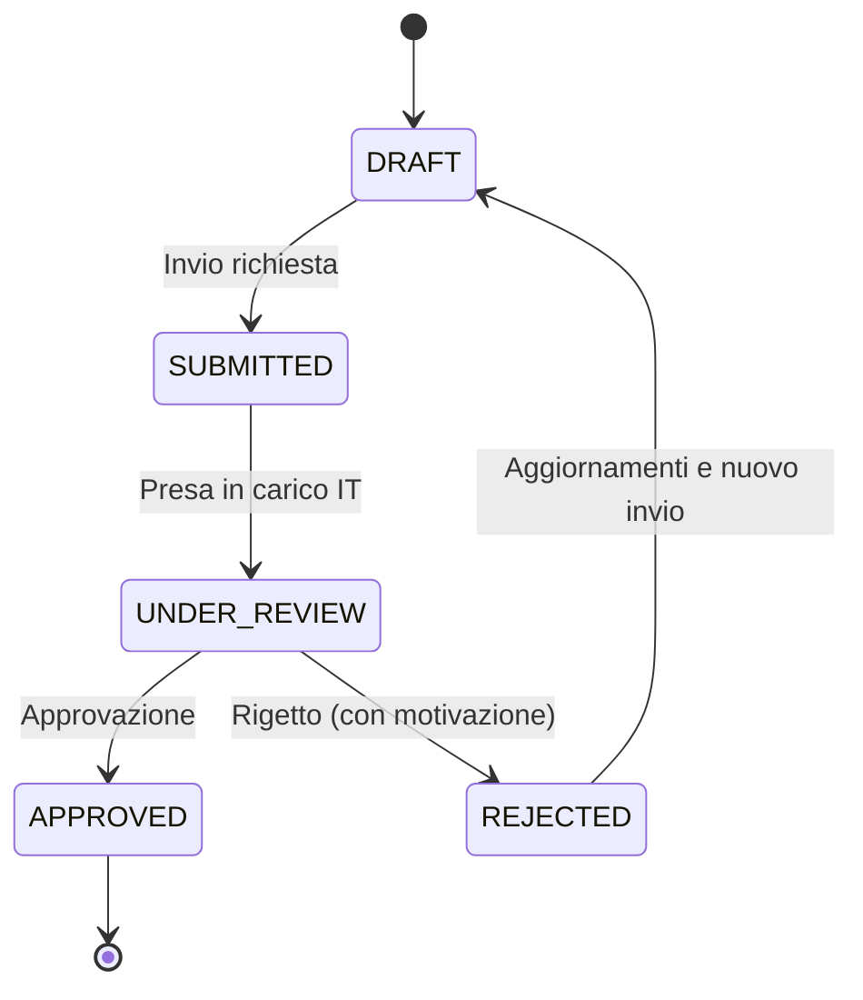
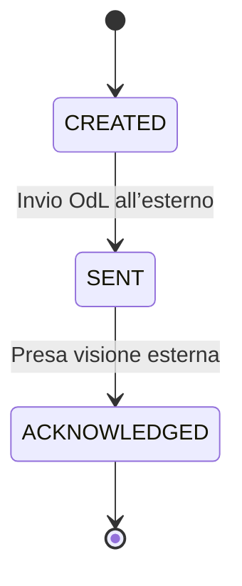
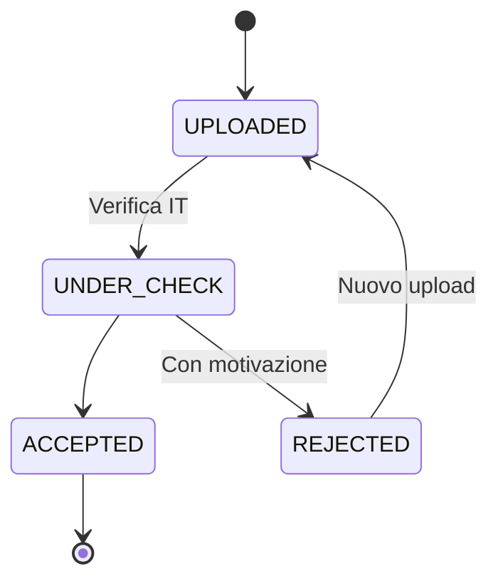
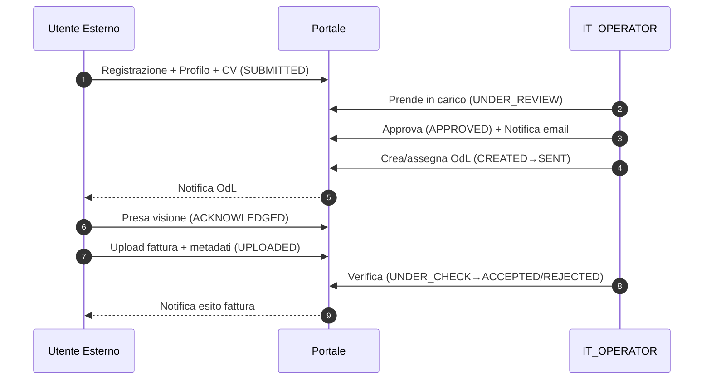
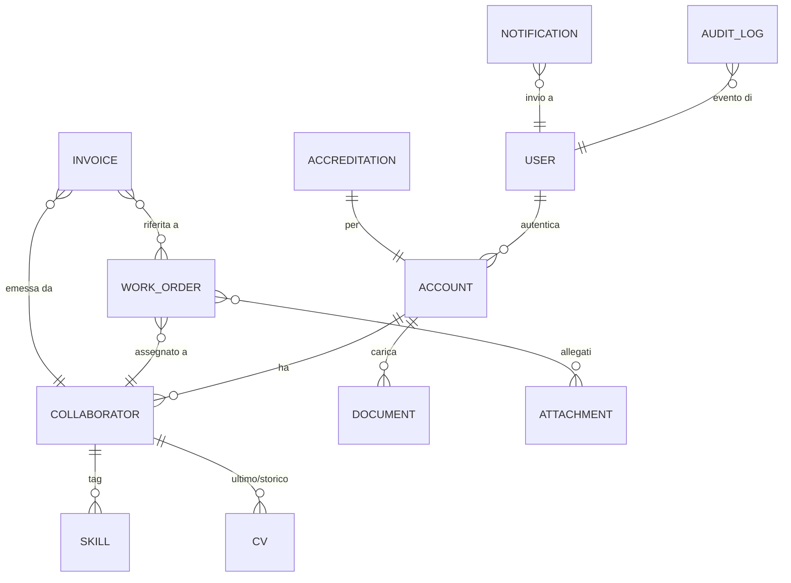

# Portale Web per la Gestione dei Collaboratori Esterni
Documento dei Requisiti Funzionali e Specifica Tecnica — POC/MVP

- Progetto: test
- Versione: 1.0
- Data: 04/01/2026
- Stato: Bozza

## 1. Scopo
Questo documento definisce in modo completo i requisiti funzionali e non funzionali, i flussi di processo, il modello dati logico, le API e gli aspetti di sicurezza del Portale Web per la Gestione dei Collaboratori Esterni di un’azienda IT. Il perimetro è orientato al POC/MVP e copre accreditamento, gestione profili/CV, ordini di lavoro (OdL) e gestione documentale delle fatture.

## 2. Contesto e Obiettivi
### 2.1 Contesto
L’azienda IT integra professionisti esterni e/o aziende fornitrici. La gestione attuale (email e file non strutturati) comporta bassa tracciabilità, scarsa reperibilità delle informazioni e attività manuali ridondanti.

### 2.2 Obiettivi
- Centralizzare accreditamento, profili, CV, OdL e fatture (gestione documentale).
- Migliorare tracciabilità e controllo operativo riducendo comunicazioni destrutturate.
- Fornire ricerca e filtri base per reperire rapidamente risorse e documenti.

## 3. Attori e Ruoli
### 3.1 Attori
- Professionista Esterno: libero professionista che opera in proprio.
- Azienda (Società Fornitrice): soggetto che opera come azienda con uno o più collaboratori.
- Azienda IT (Operatore): gestisce accreditamenti, OdL, verifica fatture e consulta CV.
- Amministratore di Sistema: gestisce utenti, ruoli, configurazioni e audit.

### 3.2 Ruoli Applicativi (RBAC)
- EXTERNAL_OWNER: professionista singolo o referente azienda fornitrice; gestisce profilo/documenti; vede OdL e fatture.
- EXTERNAL_COLLABORATOR: collaboratore associato a un’azienda; gestisce il proprio profilo/CV; vede gli OdL assegnati.
- IT_OPERATOR: valida accreditamenti; crea/assegna OdL; verifica fatture; consulta CV.
- SYS_ADMIN: gestione utenti/ruoli; configurazioni; log; sicurezza.

### 3.3 Matrice RBAC (MVP)
| Modulo/Funzione                         | EXTERNAL_OWNER | EXTERNAL_COLLABORATOR | IT_OPERATOR | SYS_ADMIN |
|-----------------------------------------|-----------------|------------------------|------------|-----------|
| Registrazione/Accesso                   | Sì              | Sì                     | Sì         | Sì        |
| Invio accreditamento                    | Sì              | Solo tramite invito    | No         | No        |
| Approva/Rigetta accreditamento          | No              | No                     | Sì         | No        |
| Gestione profilo                        | Sì (proprio)    | Sì (proprio)           | Lettura    | No        |
| Gestione collaboratori (azienda)        | Sì              | No                     | Lettura    | No        |
| Upload/gestione CV                      | Sì (proprio/azienda) | Sì (proprio)    | Lettura    | No        |
| Creazione/assegnazione OdL              | No              | No                     | Sì         | No        |
| Consultazione OdL                       | Sì (assegnati)  | Sì (assegnati)         | Sì         | No        |
| Presa visione OdL                       | Sì              | Sì                     | Lettura    | No        |
| Upload fatture                          | Sì              | Opzionale se previsto  | No         | No        |
| Verifica fatture                        | No              | No                     | Sì         | No        |
| Utenti e ruoli                          | No              | No                     | No         | Sì        |
| Configurazioni e audit                  | No              | No                     | Lettura audit | Sì     |

Note:
- Il collaboratore è creato/invitato dall’azienda e completa il proprio profilo.
- Per il POC, granularità dell’approvazione su azienda e/o collaboratori è definibile (RF-B4).

## 4. Ambito e Perimetro (MVP/POC)
### 4.1 In Scope
1. Accreditamento professionista (singolo o azienda).
2. Gestione collaboratori associati (solo account azienda).
3. Caricamento e consultazione CV e competenze.
4. Ricezione e gestione Ordini di Lavoro (OdL).
5. Caricamento e gestione documentale delle fatture.

### 4.2 Out of Scope
- Pagamenti e gestione contabile.
- Integrazioni con ERP / sistemi fiscali / SDI.
- Firma digitale e conservazione sostitutiva.
- Gestione IVA/ritenute e controlli fiscali.
- Reporting avanzato (oltre a filtri e liste base).

### 4.3 Assunzioni e Vincoli (POC)
- Autenticazione via email/password; SSO opzionale in fasi successive.
- Conservazione dell’ultimo CV come default; storico CV opzionale.
- Per OdL, stati implementati nel POC: CREATED, SENT, ACKNOWLEDGED.
- Caricamento fatture come documenti informativi; nessuna integrazione fiscale.
- Storage documentale con whitelist estensioni, limiti dimensione e segregazione logica per ruolo/tenant.

## 5. Processi e Stati
### 5.1 Accreditamento
Stati: DRAFT → SUBMITTED → UNDER_REVIEW → APPROVED / REJECTED
- Solo SUBMITTED è valutabile da IT_OPERATOR.
- REJECTED richiede motivazione; è possibile un nuovo invio dopo aggiornamenti.
- APPROVED abilita funzioni operative (OdL, fatture).



### 5.2 Ordine di Lavoro (OdL)
Stati POC: CREATED → SENT → ACKNOWLEDGED
- CREATED: creato da IT, non visibile all’esterno.
- SENT: inviato con notifica email; visibile all’assegnatario.
- ACKNOWLEDGED: presa visione dall’esterno; commento opzionale.
- Stati futuri (fuori POC): IN_PROGRESS, DONE, ARCHIVED.



### 5.3 Fattura (documentale)
Stati: UPLOADED → UNDER_CHECK → ACCEPTED / REJECTED
- REJECTED richiede motivazione; upload successivo come nuovo documento (no overwrite).



## 6. Requisiti Funzionali
### 6.1 Modulo A — Registrazione e Accreditamento
- RF-A1: Registrazione con email e password. Validazioni: email univoca, password policy minima (es. 8+ caratteri). Verifica email opzionale.
- RF-A2: Scelta tipo account: Professionista / Azienda.
- RF-A3: Compilazione profilo con dati minimi: anagrafica (nome/ragione sociale), contatti, competenze principali (tag).
- RF-A4: Caricamento documenti: minimo CV; opzionali documento identità, visura, NDA. Formati: PDF/DOCX (CV).
- RF-A5: Invio richiesta di accreditamento: transizione a SUBMITTED.
- RF-A6: Backoffice IT: lista richieste, dettaglio, approvazione/rigetto con motivazione; passaggi a UNDER_REVIEW, APPROVED o REJECTED.
- RF-A7: Notifiche email: conferma invio richiesta; esito approvazione/rigetto (con motivazione).

Campi minimi profilo:
- Professionista: Nome, Cognome, Email, Telefono, Indirizzo (opzionale), Competenze (tag), CV.
- Azienda: Ragione Sociale, P.IVA, Referente Nome/Cognome, Referente Email, Telefono, Sede, Competenze (tag), CV di referenza (opzionale) o portfolio.

### 6.2 Modulo B — Gestione Collaboratori (solo account Azienda)
- RF-B1: Creazione collaboratore (nome, email) e invito via email.
- RF-B2: Collaboratore completa profilo e carica CV.
- RF-B3: L’azienda visualizza elenco collaboratori e relativi stati di accreditamento.
- RF-B4: IT_OPERATOR può approvare azienda e/o singoli collaboratori (granularità definibile nel POC: approvazione per azienda e per collaboratore).

### 6.3 Modulo C — CV e Competenze
- RF-C1: Upload CV (PDF/DOCX). Conservazione dell’ultimo CV; storico opzionale.
- RF-C2: IT_OPERATOR consulta e scarica CV.
- RF-C3: Gestione competenze tramite tag; livello 1–5 opzionale.
- RF-C4: Ricerca/filtri lato IT: skill, stato accreditamento; disponibilità opzionale.

### 6.4 Modulo D — Ordini di Lavoro (OdL)
- RF-D1: Creazione OdL: titolo, descrizione, progetto/cliente (testo), date (opzionali), allegati.
- RF-D2: Assegnazione OdL a professionista o collaboratore specifico.
- RF-D3: Invio OdL (SENT) con notifica email.
- RF-D4: Area esterna: lista OdL assegnati, dettaglio, download allegati.
- RF-D5: Presa visione OdL (ACKNOWLEDGED) con commento opzionale.

### 6.5 Modulo E — Fatture (documentale)
- RF-E1: Upload fattura (PDF) associata a uno o più OdL, oppure a un periodo (mese/anno) per POC semplificato.
- RF-E2: Metadati minimi: numero fattura, data, importo (informativo), periodo di riferimento.
- RF-E3: Verifica IT: ACCEPTED / REJECTED con motivazione.
- RF-E4: Archivio fatture con filtri (stato, periodo, risorsa).

## 7. Pagine / Schermate (MVP)
### 7.1 Area Esterna
- Login / Registrazione
- Profilo + Documenti (CV)
- Collaboratori (solo azienda)
- Ordini di Lavoro (lista + dettaglio)
- Fatture (upload + storico)

### 7.2 Backoffice Azienda IT
- Richieste accreditamento (lista + dettaglio)
- Anagrafica risorse (ricerca/filtri, CV)
- Gestione OdL (crea, lista, dettaglio)
- Gestione fatture (verifica, lista)

### 7.3 Amministrazione
- Utenti e ruoli
- Configurazioni base (policy upload, template email)
- Audit log

### 7.4 Dettaglio di schermata (esempi)
- Registrazione: form email, password, conferma password, tipo account; checkbox privacy.
- Profilo: anagrafica, contatti, competenze (tag input), upload CV; stato accreditamento.
- Lista OdL: tabella con colonne [Titolo, Progetto/Cliente, Stato, Assegnatario, Ultimo aggiornamento, Azioni].
- Dettaglio OdL: descrizione, allegati, pulsante “Prendi visione”, campo commento.
- Fatture: form upload PDF + metadati; lista con [Numero, Data, Importo, Periodo, Stato, Esito/Note].

## 8. Requisiti Non Funzionali (minimi)
- Sicurezza: autenticazione, gestione sessione, protezione endpoint (TLS, rate limit base).
- Autorizzazioni: RBAC coerente su UI/API; filtro per risorsa assegnata.
- Audit: tracciamento azioni sensibili (approve/reject, upload/download documenti, change stato).
- Upload: whitelist estensioni, limiti dimensione; storage segregato per ruolo/tenant (logico).
- Privacy: informative GDPR; policy retention documentale minima (da definire).
- Usabilità: liste paginabili, filtri base; feedback chiaro su esiti e errori.
- Disponibilità POC: singola istanza; logging centralizzato.

## 9. Flussi End-to-End (POC)
### 9.1 Registrazione → Approvazione → OdL → Fattura


## 10. Modello Dati (logico)


Entità principali (campi chiave):
- User: id, email (unique), password_hash, role, status, created_at.
- Account: id, type (PROFESSIONAL|COMPANY), display_name, vat_number (se company), owner_user_id.
- Collaborator: id, account_id, first_name, last_name, email, phone, accreditation_status, availability (opzionale).
- Accreditation: id, account_id, status, submitted_at, reviewed_by, review_note.
- CV: id, collaborator_id, file_id, uploaded_at, is_current.
- Skill: id, collaborator_id, tag, level (1–5 opzionale).
- WorkOrder: id, title, description, project_client, dates (start/end opzionali), status, assigned_collaborator_id, created_by.
- Attachment: id, work_order_id, file_id, filename.
- Invoice: id, number, date, amount, period_month, period_year, status, collaborator_id/account_id, created_by, review_note.
- Document/File: id, path, mime_type, size, owner_id, visibility.
- AuditLog: id, user_id, action, subject_type, subject_id, metadata, created_at.
- Notification: id, user_id, template, channel, payload, status, sent_at.

Note:
- Per l’upload, Document/File centralizza metadati e storage.
- Invoice può essere associata a più OdL via tabella ponte InvoiceWorkOrder.

## 11. API (MVP)
### 11.1 Convenzioni
- Base URL: /api/v1
- Autenticazione: Bearer JWT.
- Content-Type: application/json; upload multiparte per file.
- Paginazione: query param page, size; ordinamento sort.

### 11.2 Autenticazione e Utenti
- POST /auth/register
- POST /auth/login
- GET /me
- PATCH /me

Esempio: POST /auth/register
```json
{
  "email": "user@example.com",
  "password": "Str0ngPass!",
  "accountType": "PROFESSIONAL|COMPANY"
}
```

### 11.3 Accreditamento
- POST /accreditation/submit
- GET /accreditation/me
- GET /admin/accreditations?status=SUBMITTED
- POST /admin/accreditations/{id}/review
Body:
```json
{ "decision": "APPROVED|REJECTED", "note": "Motivazione obbligatoria per REJECTED" }
```

### 11.4 Collaboratori (solo COMPANY)
- POST /company/collaborators
- GET /company/collaborators
- GET /company/collaborators/{id}
- PATCH /company/collaborators/{id}
- POST /company/collaborators/{id}/invite

### 11.5 CV e Competenze
- POST /collaborators/{id}/cv (multipart)
- GET /collaborators/{id}/cv/current
- GET /collaborators/{id}/skills
- PUT /collaborators/{id}/skills
- GET /admin/resources?skill=java&status=APPROVED

### 11.6 Ordini di Lavoro
- POST /work-orders
- GET /work-orders
- GET /work-orders/{id}
- POST /work-orders/{id}/assign
- POST /work-orders/{id}/send
- POST /work-orders/{id}/acknowledge
- GET /my/work-orders

Payload esempio creazione:
```json
{
  "title": "Sviluppo modulo X",
  "description": "Implementazione...",
  "projectClient": "Cliente ABC",
  "startDate": "2026-01-15",
  "endDate": "2026-03-31",
  "attachments": []
}
```

### 11.7 Fatture
- POST /invoices (multipart + JSON metadati)
- GET /invoices?status=UNDER_CHECK&periodMonth=1&periodYear=2026
- GET /invoices/{id}
- POST /admin/invoices/{id}/review
Body:
```json
{ "decision": "ACCEPTED|REJECTED", "note": "Motivazione se REJECTED" }
```

### 11.8 Amministrazione
- GET /admin/users
- POST /admin/users
- PATCH /admin/users/{id}
- GET /admin/audit?action=APPROVE_ACCREDITATION
- GET /admin/config
- PATCH /admin/config

## 12. Validazioni e Regole
- Email univoca; password policy (min 8, maiuscola/minuscola/numero consigliato).
- Upload:
  - CV: .pdf, .docx; max 10MB.
  - Fatture: .pdf; max 10MB.
  - Allegati OdL: .pdf, .docx, .xlsx, .zip; max 20MB.
- Accreditamento: CV obbligatorio; motivazione obbligatoria per REJECTED.
- OdL: titolo e descrizione obbligatori; assegnazione a risorsa approvata.
- Fatture: numero, data e periodo obbligatori; importo informativo.

## 13. Notifiche Email (POC)
Eventi e template:
- Accreditamento inviato: “Conferma ricezione richiesta di accreditamento.”
- Accreditamento approvato/rigettato: “Esito della tua richiesta — APPROVED/REJECTED. Motivo: {note}.”
- OdL inviato: “Nuovo Ordine di Lavoro assegnato — {title}.”
- Fattura verificata: “Esito verifica fattura — ACCEPTED/REJECTED. Motivo: {note}.”

Parametri comuni: destinatario, link al portale, id risorsa, firma automatica.

## 14. Audit Log
Tracciare almeno:
- Login/Logout (successo/fallimento).
- Submit/Review accreditamenti.
- Creazione/assegnazione/invio/ack OdL.
- Upload/Download/Review documenti (CV, fatture, allegati).
- Gestione utenti/ruoli e modifiche configurazioni.
Metadati: user_id, action, subject_type/id, timestamp, ip, user_agent.

## 15. Sicurezza
- Autenticazione JWT; scadenza token; refresh token opzionale.
- RBAC su ogni endpoint; controllo ownership (risorse esterne).
- Crittografia TLS in transito; storage sicuro per file (path non prevedibili).
- Prevenzione OWASP Top 10: CSRF (non necessario per API pure), XSS (sanitizzazione), SQLi (ORM/parametrizzazione).
- Rate limiting base; lockout progressivo su tentativi falliti.
- Backup e logging centralizzato (POC: livello base).

## 16. Criteri di Done (POC)
- Flusso end-to-end: registrazione → submit → approve → OdL assegnato → upload fattura → accept/reject.
- RBAC verificato con 4 account di test (ruoli principali).
- Audit log attivo per azioni critiche.
- Documentazione minima: README, descrizione flussi, elenco endpoint.

## 17. Piano di Test (estratto)
- Autenticazione:
  - Registrazione nuova email (OK); email duplicata (KO).
  - Login corretto/errato; lockout dopo N tentativi.
- Accreditamento:
  - Submit con CV (OK); senza CV (KO).
  - Review APPROVED/REJECTED con motivazione obbligatoria per REJECTED.
- Collaboratori:
  - Creazione invito; completamento profilo; visibilità stati.
- CV/Skill:
  - Upload formati validi; superamento limite dimensione (KO).
  - Ricerca per skill e stato.
- OdL:
  - Creazione, assegnazione a risorsa APPROVED; invio (SENT); ack esterno (ACKNOWLEDGED).
- Fatture:
  - Upload PDF con metadati; associazione a OdL; review ACCEPTED/REJECTED.
- Sicurezza:
  - Accesso a endpoint senza token (401); con token ruolo errato (403).
  - Download documenti solo a soggetti autorizzati.
- Audit:
  - Presenza evento per upload/approve/ack/review.

## 18. Configurazioni (MVP)
- Policy upload: estensioni, size limit, retention minima.
- Template email: soggetto, corpo, variabili.
- Parametri sicurezza: durata token, rate limits.
- Feature flags: storico CV, livello skill 1–5.

## 19. Roadmap Post-MVP
- Stati OdL avanzati: IN_PROGRESS, DONE, ARCHIVED.
- Disponibilità e pianificazione risorse.
- Storico CV e versioning completo.
- Integrazioni ERP/SDI; firma digitale; conservazione sostitutiva.
- Reporting avanzato e dashboard KPI.
- SSO (OIDC/SAML) e MFA.
- Gestione economica (fuori scope POC).

## 20. Glossario
- Accreditamento: processo di valutazione e approvazione di profili esterni.
- OdL (Ordine di Lavoro): incarico/commessa assegnata a una risorsa esterna.
- RBAC: Role-Based Access Control.
- POC/MVP: prototipo funzionante con set minimo di funzionalità.
- CV: curriculum vitae della risorsa.
- NDA: accordo di riservatezza.
- UNDER_CHECK: fase di verifica interna per fatture/documenti.
